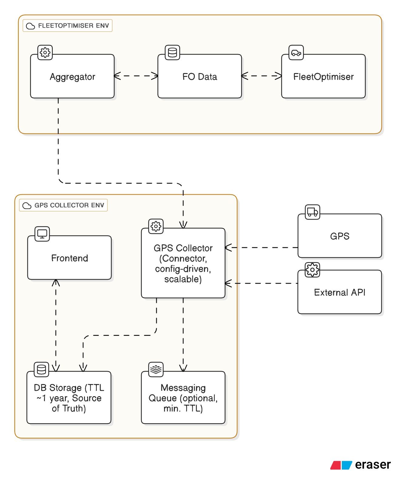

# GPS & FO Environment – Flows & Responsibilities

## Flows

### 1. Direct GPS Devices
1. GPS device sends logs → **Collector**  
2. **Collector** writes logs to **DB Storage** (source of truth, TTL ~1y)  
3. (Optional) Collector publishes logs to **Queue** for near real-time consumers  
4. **Aggregator** runs nightly, requests unseen logs → Collector serves logs from **DB Storage**  
5. **FleetOptimiser** consumes processed data from **Aggregator**  

### 2. External Provider APIs
1. **Aggregator** triggers nightly job, requests unseen logs from **Collector**  
2. **Collector** calls **External API** with last-seen timestamp/marker  
3. **Collector** streams new logs back to **Aggregator** (not stored)  
4. **FleetOptimiser** consumes processed data from **Aggregator**  

---

## Flow for Connecting a New GPS
When a new GPS device needs to be connected, the process starts in the **Frontend**. The user enters configuration details (e.g., protocol, host/port, authentication). This configuration is saved in storage and picked up by the **Collector** automatically. The Collector dynamically spins up an internal listener (lightweight coroutine/handler) for the device without requiring a new process or deployment. From then on, logs from the GPS are ingested, stored in the **DB Storage**, and made available to the **Aggregator** in the nightly runs.  

---

## Service Responsibilities

- **Collector**  
  Ingest GPS logs, write direct logs to DB, publish optional Queue messages, fetch unseen logs from external APIs, scale horizontally via config-driven setup.  

- **Storage (DB)**  
  Primary source of truth for direct GPS logs (TTL ~1y), supports unseen log queries for Aggregator.  

- **Queue (optional)**  
  Short-lived buffer for real-time consumers; not source of truth.  

- **Frontend**  
  Configure new GPS devices (writes config for Collector), provide user access to stored GPS logs. GPS viewer and active GPS configurations.  

- **Aggregator**  
  Nightly job that fetches unseen logs (DB for direct GPS, API via Collector for external), processes them, and writes results to FO Data.  

- **FO Data**  
  Stores processed/aggregated GPS data for FleetOptimiser.  

- **FleetOptimiser**  
  Consumes aggregated GPS data.  

- **External API**  
  Provides GPS logs for external fleet providers, polled on demand by Collector.  
