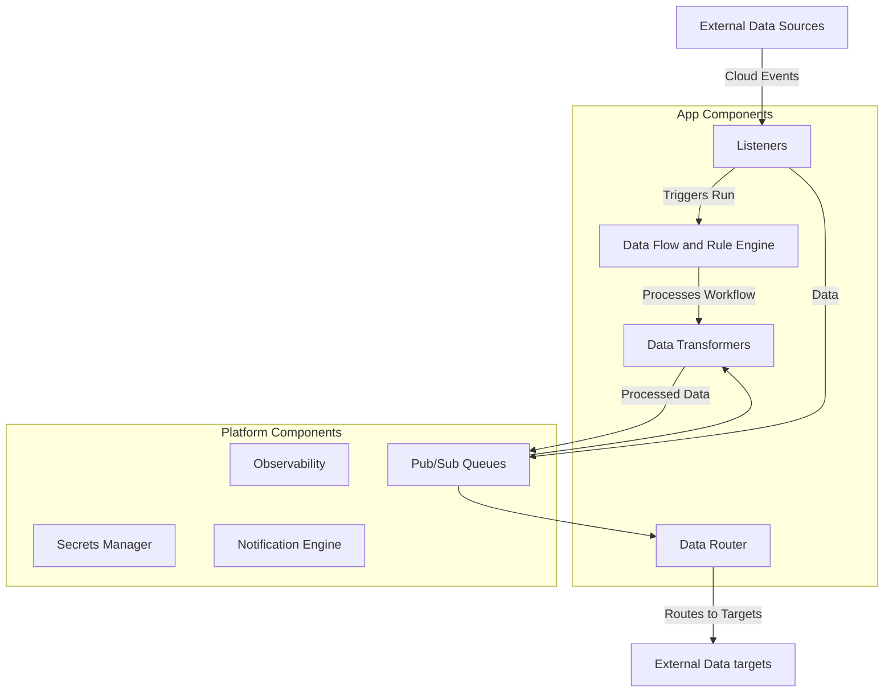

Solution Landscape

All app components
- adheres to 12 factor principles
- has seperatea declarative external configurations for simple reuse and portability
- are containerized in oci compatible containers
- has well documented templates with full boilerplate and parameters in environment variables.
- are language agnostic securing the best fit for the task
- are Stateless in design for GDPR compliant data minimization.  
- 

App Components:

- Listeners - can scale horisontally - exposes OpenAPI 3 endpoints. Recieves CloudEvents that triggers a run. 
- Built in Data flow and rule engine - Handles data rules and flows for the run based on a chosen workflow template pattern including pausing awaiting external system events or blocking based on data content.
- Data Transformers - Standalone Conversion, Data Cleaning Business Logic and Data optimizations of unprocessed data from the queue. Language agnostic components.
- Data Router - Routes processed data from a queue to data targets defined in the seperate declarative configuration. Language agnostic so the best fit for the target protocol can be choosen

Platform components
- Observability - standard upstream components that enables logging, auditability and compliance
- Secrets manager - Defined in the configurations as the source for keys, tokens etc. Handles the key exchange and encryption logic
- Queue - standard upstream open source queue with pub/sub pattern
- Notification engine - standard notifications router for typical messaging services.

External optional interfaces

In theory, if open standards and protocols are followed, and a thorough analysis shows low risk and significant business benefits, dataflow handling or transformation could be routed to external systems. However, the documentation and implementation effort required might be so extensive that it undermines the business case."

